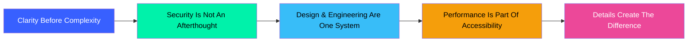

<!-- Banner Animation -->
<div align="center">


# 👋 Welcome to My Digital Universe

[](https://chessbuddybuzz.pages.dev/)
[](https://github.com/DharmeshKumar0)
[](https://linkedin.com/in/dharmesh-kumar)
[](mailto:dharmeshkumar08.in@gmail.com)

</div>

---

## 🎯 About Me

<div align="center">

```typescript
const dharmesh = {
  location: "Rajgarh, Rajasthan, India 🇮🇳",
  education: "B.Tech Computer Science (2021–2025)",
  university: "Bikaner Technical University, Pilani",
  focus: ["Full-Stack Development", "Cybersecurity", "Generative AI", "Kinetic UI"],
  mission: "Building digital experiences where security & craft converge"
};
```

</div>

> 🔐 **Security-First Developer** | Too often, developers treat security as a compliance afterthought, and security engineers treat user experience as a secondary compromise. **My work bridges both disciplines.**

---

## ⚡ Tech Stack Arsenal

<div align="center">

### Frontend Engineering


### Backend & Databases


### Cybersecurity & SOC


### Cloud & DevOps


### AI & Intelligence


</div>

---

## 🚀 Featured Projects

<div align="center">

### 🏆 Flagship Projects

</div>

<table align="center" width="100%">
<tr>
  <td width="50%" valign="top">
    <div align="center">
      <h3>♟️ ChessBuddyBuzz</h3>
      <p><strong>Real-Time Chess Intelligence Platform</strong></p>
      <p>Stockfish 18 engine analysis, WebSocket multiplayer, centipawn eval bar</p>
      
[](https://chessbuddybuzz.pages.dev/)
[](https://github.com/DharmeshKumar0/ChessBuddyBuzz)

```typescript
Tech: React 19 • TypeScript • 
Stockfish 18 • WebSockets • 
Zustand • Tailwind v4
```
    </div>
  </td>
  <td width="50%" valign="top">
    <div align="center">
      <h3>🤖 AI Career Coach</h3>
      <p><strong>Next-Gen Intelligent Career Advisor</strong></p>
      <p>Server-side rendering, Firebase OAuth 2.0, Claude & Gemini AI</p>
      
[](#)
[](https://github.com/DharmeshKumar0)

```typescript
Tech: Next.js • Claude Sonnet 3.5 • 
Gemini AI • Firebase OAuth • 
Prisma ORM • RBAC
```
    </div>
  </td>
</tr>
<tr>
  <td width="50%" valign="top">
    <div align="center">
      <h3>🔍 AI Code Reviewer</h3>
      <p><strong>Automated Security Audit Suite</strong></p>
      <p>MERN stack code analysis, OWASP vulnerability detection</p>
      
[](https://github.com/DharmeshKumar0/Code-Reviewer)

```typescript
Tech: MERN • Gemini API • 
Prism.js • OWASP Top 10 • 
CORS Protection
```
    </div>
  </td>
  <td width="50%" valign="top">
    <div align="center">
      <h3>🛡️ SOC & Network Lab</h3>
      <p><strong>Threat Defense Sandbox</strong></p>
      <p>Incident triage, log anomaly detection, packet inspection</p>
      
[](#)

```typescript
Tech: Wireshark • TCP/IP • 
DNS Analysis • Firewall Rules • 
SIEM Log Triage
```
    </div>
  </td>
</tr>
</table>

<div align="center">

### 📦 More Projects

[](https://amazon-clone-gamma-kohl.vercel.app/)
[](https://github-finder-rho-lovat.vercel.app/)
[](https://gemini-app-frontend-two.vercel.app/)
[](https://animate-orcin.vercel.app/)

</div>

---

## 💼 Experience Timeline

<div align="center">

| Period | Role | Company | Focus |
|--------|------|---------|-------|
| **Jul 2024 – Sep 2024** | Front-End Developer Intern | CodeSoft | Next.js, AI Integration, OAuth 2.0 |
| **May 2023 – Jun 2023** | Web Development Trainee | BPTRC, BKBIET | GCP, GSAP, React Performance |
| **2023 – Present** | Technical Member & Mentor | BKBIET Technical Club | Leadership, Documentation, Workflow Optimization |

</div>

---

## 📜 Certifications & Credentials

<div align="center">


</div>

---

## 🧠 Core Philosophy

<div align="center">



</div>

---

## 📊 GitHub Activity

<div align="center">


</div>

---

## 🎯 Skills Matrix

<div align="center">

### Languages & Scripting


### Cybersecurity Operations


</div>

---

## 🌐 Connect & Collaborate

<div align="center">

### Let's Build Something Extraordinary Together

[](https://chessbuddybuzz.pages.dev/)
[](https://github.com/DharmeshKumar0)
[](https://linkedin.com/in/dharmesh-kumar)
[](mailto:dharmeshkumar08.in@gmail.com)
[](tel:+919509656755)

</div>

---

## 📬 Get In Touch

<div align="center">

```bash
# Send me an email
echo "dharmeshkumar08.in@gmail.com"

# Call me
echo "+91-9509656755"

# Location
echo "Rajgarh, Rajasthan, India 🇮🇳"

# Availability
echo "Available for Software Development & Security Roles"
```

</div>

---

## 🎨 Portfolio Features

This repository contains my **interactive portfolio website** built with cutting-edge technologies:

✨ **Key Features:**
- 🎭 Custom kinetic cursor with smooth tracking
- 🌓 Dark/Light theme toggle with persistence
- 📱 Fully responsive editorial layout
- ⚡ 60 FPS animations powered by Motion & GSAP
- 🔍 Interactive project case studies with deep-dive modals
- 🎹 Keyboard shortcuts (Ctrl+K, Shift+D, `~` for Workbench Console)
- 📊 Skills constellation visualization
- 📅 Experience timeline with interactive nodes
- 🏆 Certifications showcase
- 💡 Philosophy & engineering principles section
- 🧪 Lab section for security experiments
- ✉️ Contact form with direct inquiry routing

---

## 🛠️ Local Development

```bash
# Clone the repository
git clone https://github.com/DharmeshKumar0/portfolio.git

# Navigate to directory
cd portfolio

# Install dependencies
bun install

# Start development server
bun run dev

# Build for production
bun run build

# Preview production build
bun run preview
```

---

<div align="center">

### 🚀 Engineered with strict zero-trust rigor, animated with fluid tactile precision.


© 2025 Dharmesh Kumar. All Rights Reserved.

</div>

<!-- Animated Footer Wave -->
<div align="center">


**Thanks for visiting!** 🙏

</div>
